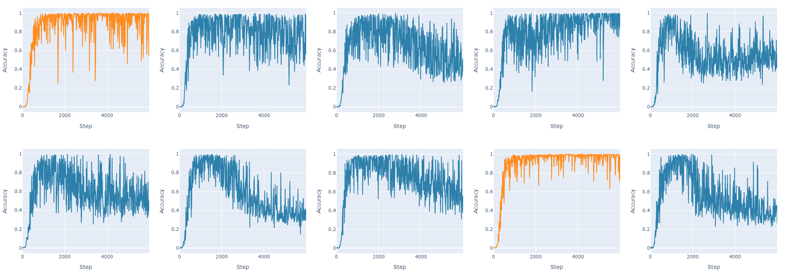
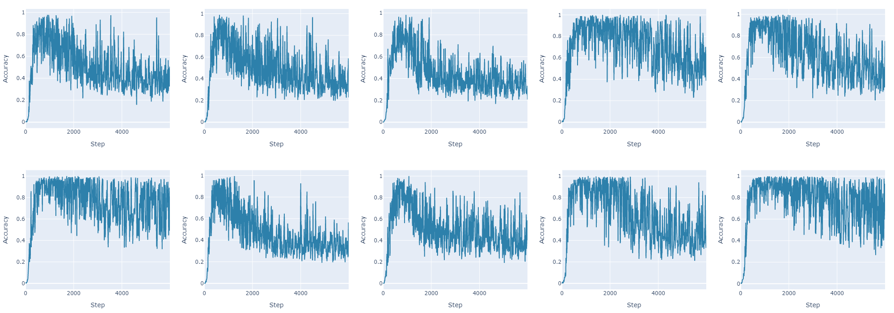
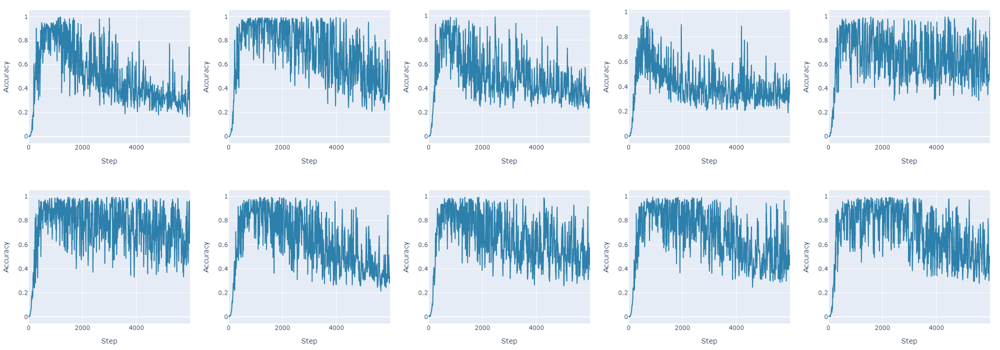

# Learning Algorithms from Scratch with a Transformer

### Interactive demo: [https://siliconsloth.com/posts/learning-algorithms-from-scratch/](https://siliconsloth.com/posts/learning-algorithms-from-scratch/)

This project trains a transformer model to sort lists using a self-learned algorithm.
Given a list of digits 0-9, the model generates some blank intermediate tokens followed by the sorted list.
This demonstrates how transformers can learn their own multi-step procedures to solve
simple algorithmic problems in an unsupervised manner.

## Usage

Run `train.py` to train the model for 6000 steps. The script will save model checkpoints periodically.

Run `test.py` to run the trained model on some example lists and compute an accuracy score.
Run `test.py --mask-blanks` to see the effect of masking out the blank intermediate tokens.

You can find an interactive demo of the model at [siliconsloth.com](https://siliconsloth.com/posts/learning-algorithms-from-scratch/).

## Requirements

Requires PyTorch and TensorBoard to be installed.

## Experiments

The model has a low chance of convergence, so multiple training runs are required to get a model with high accuracy.
Convergent runs show short, frequent accuracy drops that must be avoided when selecting a model checkpoint for evaluation.
That said, convergent runs typically seem to converge quickly and evaluation accuracy is strong if the accuracy drops are avoided.

## Ablation Studies

### No intermediate tokens

Without the intermediate blank tokens, the model never seems to converge.

### No intermediate tokens, with position offsets

One possible explanation for the improved accuracy when using blank intermediate tokens is that the increased
gap between the input and output tokens makes it easier to attend to them separately.  We can emulate this effect
by disabling the intermediate tokens but offsetting the position encodings of the output to emulate the presence of
the intermediate tokens. This approach does not seem to improve accuracy, showing that the blank tokens themselves
are key to the improved model performance.